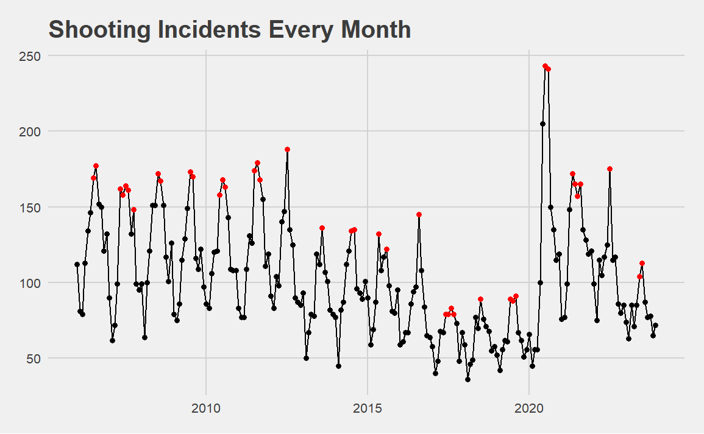
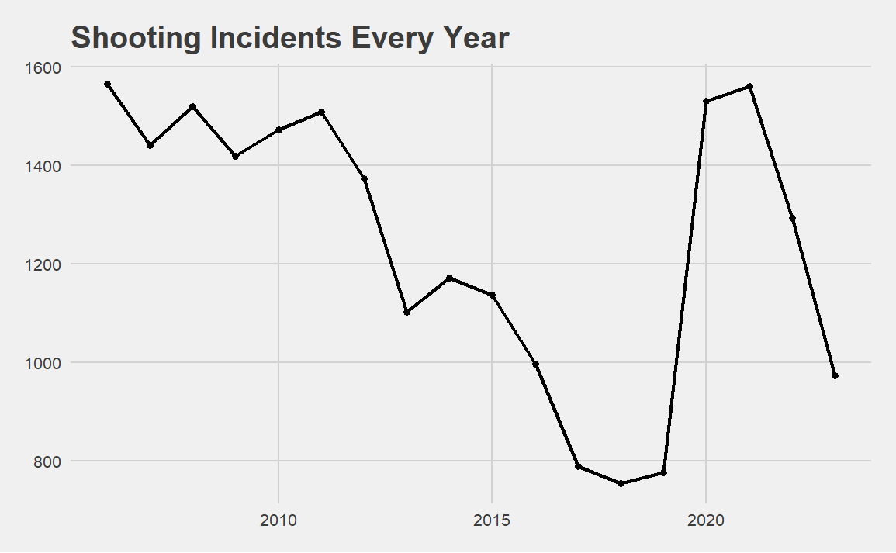
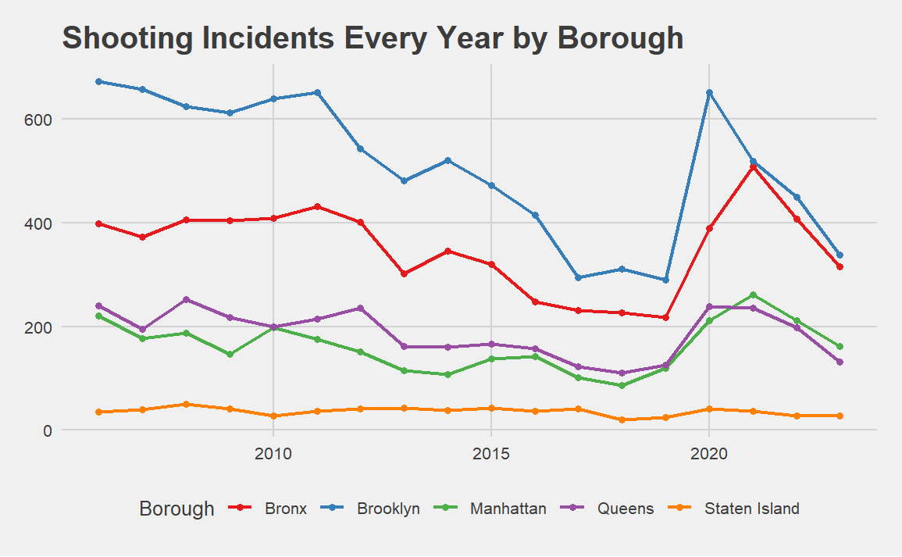
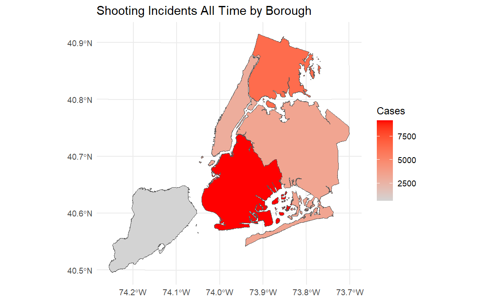
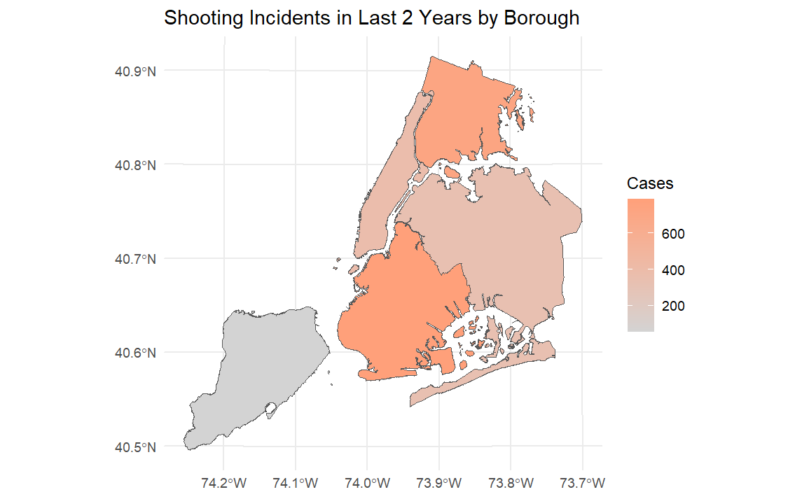
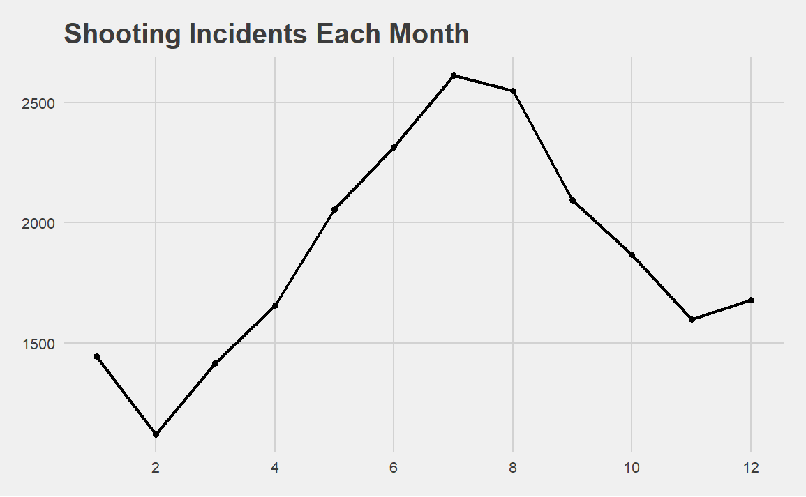
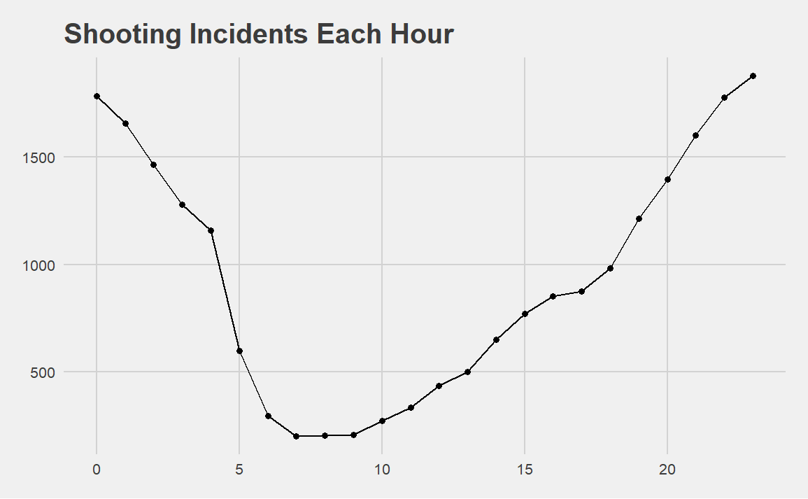
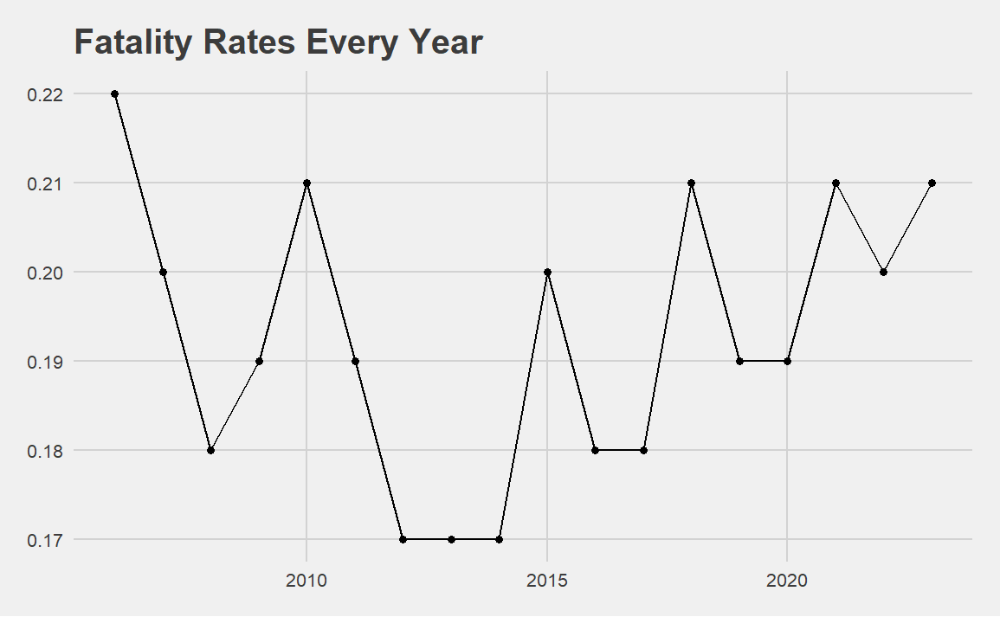
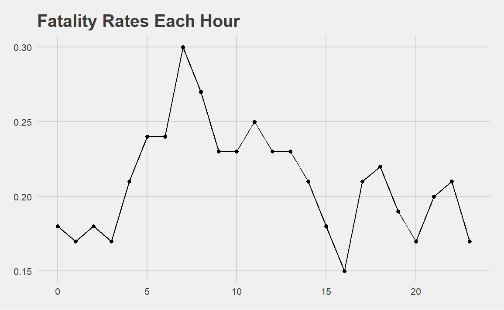
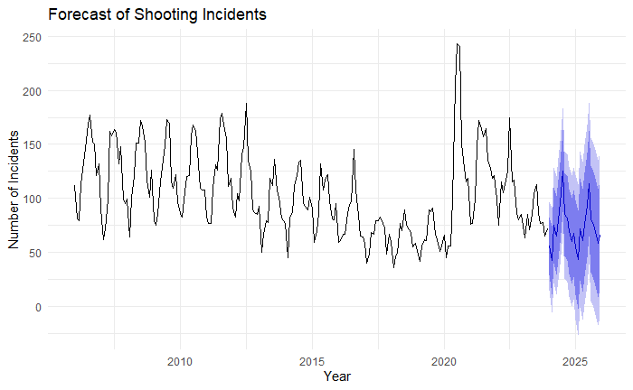

# **1. Introduction**

The project will focus on the timing and locations of shooting incidents. It will investigate the specific times, months, and boroughs most affected by shootings and examine the patterns of these occurrences.

# **2. Summary**

## Possibly Bias

Bias can come from the data collection process, which only records shooting incidents with injured victims. It implies that there could be additional unrecorded shootings, casting uncertainty on how these incidents might influence the data. Another bias arises from the lack of population data for the city and its boroughs; a larger population could be a reason for higher shooting incidents.

## Trends and Where did Shootings Happened?

The plot illustrates the monthly occurrence of shooting incidents from 2006 to 2023. A yearly periodic pattern is evident, with incidents peaking in the summer and declining in the winter. Notably, there was a significant decrease after 2012 and 2016, followed by a sharp increase in 2020, with a gradual return to the pre-2020 pattern.

{width="450"}

We can observe a distinct trend by plotting annual shooting incidents. After 2012, incidents decreased to approximately 75% and dropped to 50% after 2016. However, there was a resurgence in 2020, followed by a downward trend that returned to 50%.

{width="450"}

Further analysis of annual shooting incidents by borough reveals that initially, Brooklyn had a much higher number of shootings compared to other boroughs, with numbers later approaching those of the Bronx. Both Brooklyn and the Bronx reported twice as many shootings as the other boroughs.

{width="450"}

We can visualize shooting incidents on the map for all time and also for the past two years.

{width="520"}

{width="520"}

## When did Shootings Happened?

Shootings peak between June and August and reach their lowest points from January to March.

{width="450"}

The shooting incidents is lowest in the morning and noon, then gradually increases throughout the day, reaching a peak at midnight. Following that, it begins to decline until morning.

{width="450"}

## How about Fatality Rates

The overall fatality rate is approximately 20%. At seven in the morning, the fatality rate peaks at about 30%.

{width="450"}

{width="450"}

## Forecast with ARIMA

Applied the Autoregressive Integrated Moving Average (ARIMA) method to forecast the next 24 months trend.

(width="450")

# **3. Data Source**

## Links

NYC Open Data Webpage: [[*NYPD Shooting Incident Data (Historic)*]{.underline}](https://data.cityofnewyork.us/Public-Safety/NYPD-Shooting-Incident-Data-Historic-/833y-fsy8/about_data).

DATA.GOV Webpage: [[*NYPD Shooting Incident Data (Historic)*]{.underline}](https://catalog.data.gov/dataset/nypd-shooting-incident-data-historic)

CSV File: [[*NYPD Shooting Incident Data (Historic)*]{.underline}](https://data.cityofnewyork.us/api/views/833y-fsy8/rows.csv?accessType=DOWNLOAD).

## What's in this Dataset?

You can find below content in the attachments section of [[*NYPD Shooting Incident Data (Historic)*]{.underline}](https://data.cityofnewyork.us/Public-Safety/NYPD-Shooting-Incident-Data-Historic-/833y-fsy8/about_data).

Field Names and Descriptions are as follows:

| Field Name              | Description                                                                                                                                                                         |
|--------------------------|----------------------------------------------|
| INCIDENT_KEY            | Randomly generated persistent ID for each incident                                                                                                                                  |
| OCCUR_DATE              | Exact date of the shooting incident                                                                                                                                                 |
| OCCUR_TIME              | Exact time of the shooting incident                                                                                                                                                 |
| BORO                    | Borough where the shooting incident occurred                                                                                                                                        |
| PRECINCT                | Precinct where the shooting incident occurred                                                                                                                                       |
| JURISDICTION_CODE       | Jurisdiction where the shooting incident occurred. Jurisdiction codes 0(Patrol), 1(Transit), and 2(Housing) represent NYPD whilst codes 3 and more represent non NYPD jurisdictions |
| LOCATION_DESC           | Location of the shooting incident                                                                                                                                                   |
| STATISTICAL_MURDER_FLAG | Shooting resulted in the victim’s death which would be counted as a murder                                                                                                          |
| PERP_AGE_GROUP          | Perpetrator’s age within a category                                                                                                                                                 |
| PERP_SEX                | Perpetrator’s sex description                                                                                                                                                       |
| PERP_RACE               | Perpetrator’s race description                                                                                                                                                      |
| VIC_AGE_GROUP           | Victim’s age within a category                                                                                                                                                      |
| VIC_SEX                 | Victim’s sex description                                                                                                                                                            |
| VIC_RACE                | Victim’s race description                                                                                                                                                           |
| X_COORD_CD              | Midblock X-coordinate for New York State Plane Coordinate System, Long Island Zone, NAD 83, units feet (FIPS 3104)                                                                  |
| Y_COORD_CD              | Midblock Y-coordinate for New York State Plane Coordinate System, Long Island Zone, NAD 83, units feet (FIPS 3104)                                                                  |
| Latitude                | Latitude coordinate for Global Coordinate System, WGS 1984, decimal degrees (EPSG 4326)                                                                                             |
| Longitude               | Longitude coordinate for Global Coordinate System, WGS 1984, decimal degrees (EPSG 4326)                                                                                            |

1.  Information is accurate as of the date it was queried from the system of record, but should be considered a close approximation of current records, due to revisions and updates.
2.  Data is available as of the date that technological enhancements to information systems allowed for data capture. Null values appearing frequently in certain fields may be attributed to changes on official department forms where data was previously not collected. Null values may also appear in instances where information was not available or unknown at the time of the report and should be considered as either “Unknown/Not Available/Not Reported.”
3.  A shooting incident can have multiple victims involved and as a result duplicate INCIDENT_KEY’s are produced. Each INCIDENT_KEY represents a victim but similar duplicate keys are counted as one incident.
4.  Shooting incidents occurring near an intersection are represented by the X coordinate and Y coordinates of the intersection Shooting incidents occurring anywhere other than at an intersection are geo-located to the middle of the nearest street segment where appropriate.
5.  Any attempt to match the approximate location of the incident to an exact address or link to other datasets is not recommended.
6.  Many other shooting incidents that were not able to be geo-coded (for example, due to an invalid address) have been located as occurring at the police station house within the precinct of occurrence.
7.  Shooting incidents occurring in open areas such as parks or beaches may be geo-coded as occurring on streets or intersections bordering the area.
8.  Shooting incidents occurring on a moving train on transit systems are geo-coded as occurring at the train’s next stop.
9.  All shooting incidents occurring within the jurisdiction of the Department of Correction have been geo-coded as occurring on Riker’s Island.
10. X and Y Coordinates are in NAD 1983 State Plane New York Long Island Zone Feet (EPSG 2263).
11. Latitude and Longitude Coordinates are provided in Global Coordinate System WGS 1984 decimal degrees (EPSG 4326).
12. Errors in data transcription may result in nominal data inconsistencies.
13. The CSV file should be opened using an appropriate tool for data exploration, e.g. SPSS, SAS, Tableau, etc. If using MS Excel, be sure to use the tools for importing external data, otherwise inconsistencies may occur when viewing the data.
14. Only valid shooting incidents resulting in an injured victim are included in this release. Shooting incidents not resulting in an injured victim are classified according to the appropriate offense according to NYS Penal Law.

# **4. Data Analyzing**

## Import Libraries

```{r install, eval=FALSE}
install.packages("dplyr")
install.packages("tidyverse")
install.packages("lubridate")
install.packages("ggplot2")
install.packages("scales")
install.packages("ggthemes")
install.packages("sf")
install.packages("devtools")
install.packages("forecast")
```

```{r import libraries}
library(dplyr)
library(tidyverse)
library(ggthemes)
library(lubridate)
library(ggplot2)
library(scales)
library(devtools)
library(sf)
devtools::install_github("mfherman/nycgeo")
library(nycgeo)
library(forecast)
```

## Import Data

Store NYPD Shooting Incident Data (Historic) csv file in the nypd variable.

```{r import data}
link <- "https://data.cityofnewyork.us/api/views/833y-fsy8/rows.csv?accessType=DOWNLOAD"
nypd <- read.csv(link)
head(nypd)
```

## Data Exploration and Data Cleaning

Select and rename chosen columns. Sort the table by `key`.

```{r select columns}
nypd <- nypd %>%
    select(INCIDENT_KEY, OCCUR_DATE, OCCUR_TIME, BORO, STATISTICAL_MURDER_FLAG) %>%
    rename(key = INCIDENT_KEY,
           date = OCCUR_DATE,
           time = OCCUR_TIME,
           borough = BORO,
           murdered = STATISTICAL_MURDER_FLAG) %>%
    arrange(key)

summary(nypd)
```

*`key`* Column

Each key represents a shooting incident. A shooting incident can have multiple victims.

```{r key column}
summary(nypd$key)
cat("\n\n")
cat("Unique Incidents\n")
length(unique(nypd$key))
```

*`date`* Column

Convert the character type to the date type. The date spans a range of 216 months from January 2006 to December 2023.

```{r date column}
nypd <- nypd %>% mutate(date = mdy(date))
summary(nypd$date)
```

*`time`* Column

Keep the hour(0-23) only and rename the column to `hour`.

```{r hour column}
nypd$time <- hour(hms(nypd$time))
nypd <- nypd %>% rename(hour = time)
summary(nypd$hour)
```

*`borough`* Column

Transform borough names to the title case.

```{r borough column}
nypd$borough <- str_to_title(nypd$borough)
count(nypd, borough)
```

*`murdered`* Column

Transform the str type to the logical type.

```{r murdered column}
nypd$murdered <- as.logical(nypd$murdered)
count(nypd, murdered)
```

## Data Analyzing

To find out history shooting incidents, we keep the distinct incident keys and count the number of rows that group by months.

```{r shooting_per_month}
shooting_per_month <- nypd %>%
    # Keep one row for the same incident keys
    distinct(key, .keep_all=TRUE) %>%
    # Shooting incidents group by month
    mutate(floor_month = floor_date(date, "month")) %>%
    count(floor_month, name = "shooting") %>%
    # Get year and month
    mutate(year = year(floor_month),
           month = month(floor_month))

shooting_per_month
```

Calculate the maximum number of shooting incidents for each year and create a `highlight` column. This column should be set to TRUE if the number of shooting incidents in that month is greater than or equal to 90% of the maximum number of incidents for that year.

```{r max and highlight}
threshold <- 0.9

max_highlight <- shooting_per_month  %>%
    # Max shooting incidents each year
    # Highlight months that shooting incidents >= max_shooting
    group_by(year) %>%
    mutate(max_shooting = max(shooting),
           highlight = ifelse(shooting >= max_shooting * threshold, TRUE, FALSE))

max_highlight
```

Create a line chart and emphasize the most severe months, where incidents exceed 90% of each year's maximum cases. The data indicates a cyclical trend, with the number of shooting incidents typically increasing during the summer and decreasing during the winter. There was a marked reduction in these incidents following the years 2012 and 2016, and a considerable increase at the start of 2020.

```{r}
max_highlight %>%
    ggplot(aes(floor_month, shooting)) +
    geom_line() +
    geom_point(aes(color = highlight), show.legend = FALSE) +
    scale_color_manual(values = c("TRUE" = "red", "FALSE" = "black")) +
    labs(title = "Shooting Incidents Every Month") +
    theme_fivethirtyeight()
```

```{r}
shooting_per_month %>%
    group_by(year) %>%
    summarise(n = sum(shooting)) %>%
    ggplot(aes(year, n)) +
    geom_line(linewidth = 1) + 
    geom_point(size = 1.5) +
    labs(title = "Shooting Incidents Every Year") +
    theme_fivethirtyeight()
```

```{r}
nypd %>%
    distinct(key, .keep_all=TRUE) %>%
    mutate(year = year(date)) %>%
    group_by(borough, year) %>%
    summarise(n = n()) %>%
    ggplot(aes(year, n, colour = borough)) +
    geom_line(linewidth = 1) + 
    geom_point(size = 1.5) +
    scale_color_brewer(palette = "Set1") +
    labs(title = "Shooting Incidents Every Year by Borough", color = "Borough") +
    theme_fivethirtyeight()
```

```{r}
shooting_per_month %>%
    group_by(month) %>%
    summarise(n = sum(shooting)) %>%
    ggplot(aes(month, n)) +
    geom_line(linewidth = 1) +
    geom_point(size = 1.5) +
    scale_x_continuous(breaks = pretty_breaks(n = 5)) +
    labs(title = "Shooting Incidents Each Month") +
    theme_fivethirtyeight()
```

```{r}
nypd %>%
    distinct(key, .keep_all=TRUE) %>%
    mutate(month = month(date)) %>%
    group_by(borough, month) %>%
    summarise(n = n()) %>%
    ggplot(aes(month, n, colour = borough)) +
    geom_line(linewidth = 1) + 
    geom_point(size = 1.5) +
    scale_color_brewer(palette = "Set1") +
    scale_x_continuous(breaks = pretty_breaks(n = 5)) +
    labs(title = "Shooting Incidents Each Month by Borough", color = "Borough") +
    theme_fivethirtyeight()
```

```{r}
nypd %>%
    # Keep one row for the same incident keys
    distinct(key, .keep_all=TRUE) %>%
    count(hour, name = "case") %>%
    ggplot(aes(hour, case)) +
    geom_line() + 
    geom_point() +
    labs(title = "Shooting Incidents Each Hour") +
    theme_fivethirtyeight()
```

```{r}
nypd %>%
    distinct(key, .keep_all=TRUE) %>%
    group_by(borough, hour) %>%
    summarise(n = n()) %>%
    ggplot(aes(hour, n, colour = borough)) +
    geom_line(linewidth = 1) + 
    geom_point(size = 1.5) +
    scale_color_brewer(palette = "Set1") +
    labs(title = "Shooting Incidents Each Hour by Borough", color = "Borough") +
    theme_fivethirtyeight()
```

```{r}
nypd %>%
    mutate(year = year(date)) %>%
    group_by(year) %>%
    summarise(total = n(),
              killed = sum(murdered)) %>%
    mutate(rate = round(killed / total, 2)) %>%
    ggplot(aes(year, rate)) +
    geom_line() +
    geom_point() +
    labs(title = "Fatality Rates Every Year") +
    theme_fivethirtyeight()
```

```{r}
nypd %>%
    group_by(hour) %>%
    summarise(total = n(),
              killed = sum(murdered)) %>%
    mutate(rate = round(killed / total, 2)) %>%
    ggplot(aes(hour, rate)) +
    geom_line() +
    geom_point() +
#    scale_x_continuous(breaks = pretty_breaks(n = 10)) +
    labs(title = "Fatality Rates Each Hour") +
    theme_fivethirtyeight()
```

```{r}
# Load the borough boundaries data
boroughs <- nycgeo::borough_sf
boroughs
```

```{r}
case_by_boro <- nypd %>%
    distinct(key, .keep_all = TRUE) %>%
    group_by(borough) %>%
    count() %>%
    rename(borough_name = borough)


boroughs %>%
    left_join(case_by_boro, by = "borough_name") %>%
    ggplot() +
    geom_sf(aes(fill = n)) +
    scale_fill_gradient(low = "lightgray", high = "red") +
    labs(title = "Shooting Incidents All Time by Borough", fill = "Cases") +
    theme_minimal()
```

```{r}
case_by_boro_last2y <- nypd %>%
    distinct(key, .keep_all = TRUE) %>%
    mutate(year = year(date)) %>%
    filter(year >= 2022) %>%
    group_by(borough) %>%
    count() %>%
    rename(borough_name = borough)


boroughs %>%
    left_join(case_by_boro_last2y, by = "borough_name") %>%
    ggplot() +
    geom_sf(aes(fill = n)) +
    scale_fill_gradient(low = "lightgray", high = "lightsalmon") +
    labs(title = "Shooting Incidents in Last 2 Years by Borough", fill = "Cases") +
    theme_minimal()
```

```{r}
# Convert to time series object
ts_data <- ts(shooting_per_month$shooting, start = c(2006, 1), frequency = 12)

# Fit ARIMA model
fit <- auto.arima(ts_data)

# Forecast incidents for the next 24 months
forecast_data <- forecast(fit, h = 24)

# Plot the forecast
autoplot(forecast_data) +
    labs(title = "Forecast of Shooting Incidents",
         y = "Number of Incidents") +
    theme_fivethirtyeight()
```

Note that the `echo = FALSE` parameter was added to the code chunk to prevent printing of the R code that generated the plot.
